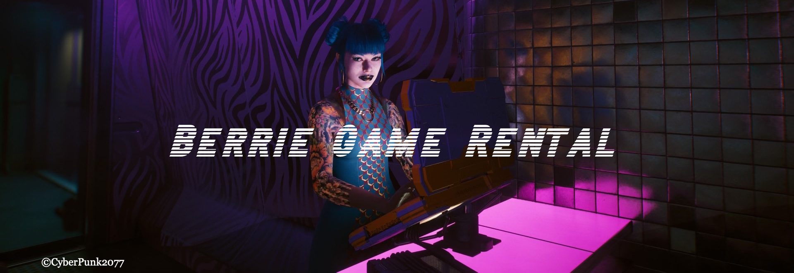

### Description
Berrie Game Rental is a video game rental application where users can submit games for rent, rent games themselves and return them. I decided to build this application as a fun way to exercise and develop my web application development skills.
The idea was inspired an earlier memory of lending to and borrowing video games from many friends and having to keep track of who's got what in the day's of CD's and game catridges exclusively.

### Features
You'll find the backend service for the application in this repository and the frontend website will be linked here _soon_.  
The application is able to support a user searching for a game to rent, viewing all the games in inventory, renting a game and returning a game. 
*This application has been thoroughly tested with unit and integration tests.*

### Installation
**Prerequisite**: [download Docker](https://www.docker.com). 
**Set SDK Level**: Open the project in intelliJ and set the `SDK` language level to `Java17` 
**Setup MongoDB containers**: Navigate to the `docker-compose.yaml` file and run the file, which is equivalent to running `docker-compose up`. 
**Run App**: The application can be run from `GameRentalApplication.java`

### Technologies
Structure : **OOP** 
Language : **Java** 
Framework : **Spring Boot** 
API : **REST Api** 
Database : **MongoDB** 
Containerisation : **Docker** 
Security : **Spring Security JWT** 
Testing : **Junit • Mockito • AssertJ** 

 
  
  
  
  
  

### Future Developments
Future developments of the application may include incorporating a global games database api, which will be used to filter games submitted to only games which can be verified as existing.

### Connect with me 

